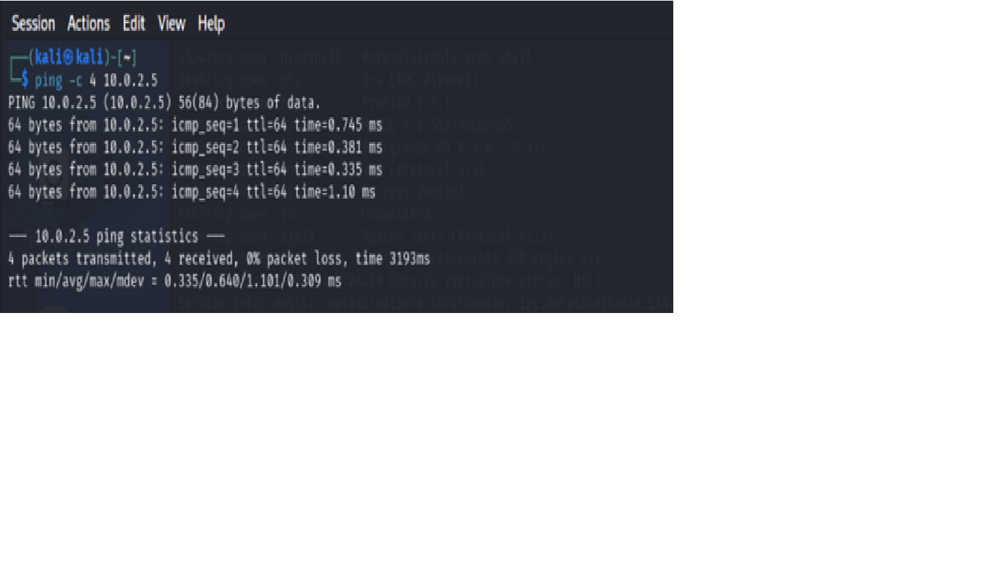
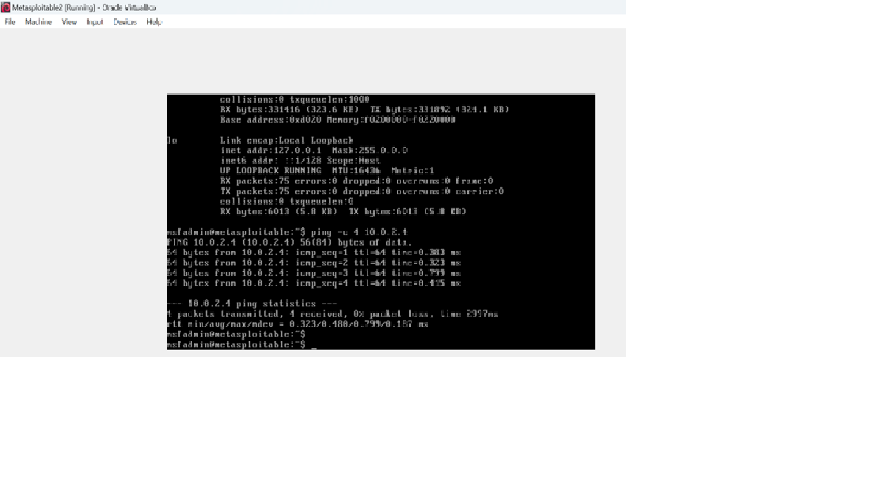
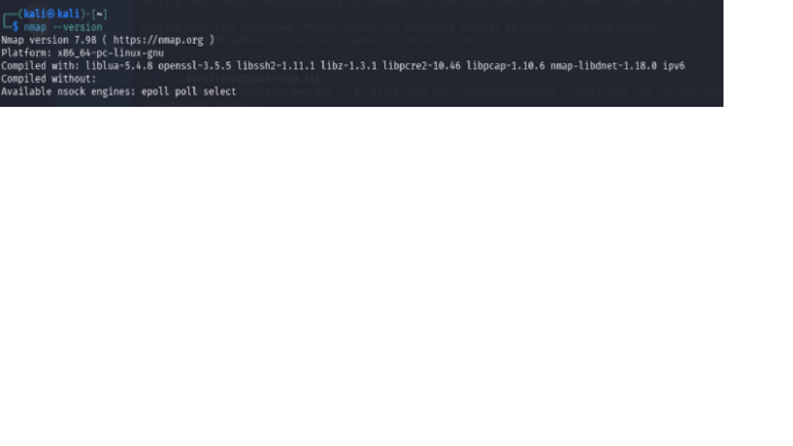
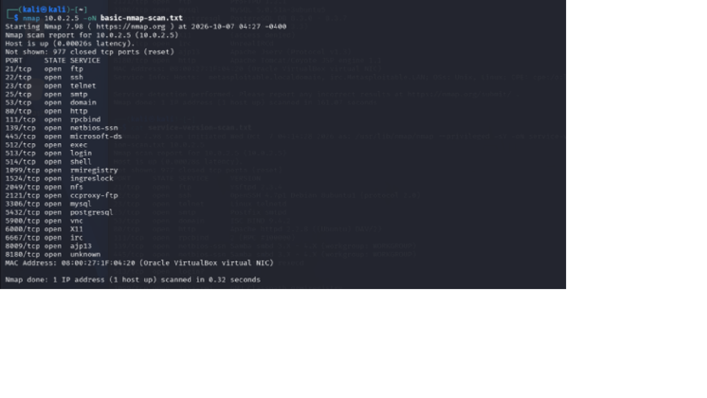

# Objective 

Perform a network scan to identify open ports and services running on a local machine or virtual machine using Nmap, and document your findings with security analysis.

# Tech Stack / Tools

Nmap, Linux terminal (or Windows PowerShell), a local VM (e.g., VirtualBox with Kali Linux or Ubuntu)

# Task 1: Basic Network Scanning with Nmap

## What is Nmap?

Nmap is also called Network Mapper. It is an open-source network scanning and security auditing tool. It is used to discover hosts and services on a network, identify open ports, detect running services and in some cases, determine the operating system of a target system.

In this lab, Nmap was used from Kali Linux to scan the Metasploitable 2 virtual machine in an isolated laboratory environment.

## Why Network Scanning Matters

Network scanning is an important part of cybersecurity because it helps security professionals understand what systems and services are accessible on a network.

Scanning can help to:

- Identify active hosts and open ports.
- Discover services running on systems that are on the network.
- Identify potential entry points that may require further security assessment.
- Detect services that are exposed.
- Provide information that can be used to improve network security and reduce the attack surface.

In this lab, Nmap scanning was used to identify the open ports and services on the intentionally vulnerable Metasploitable 2 system.

## Ethical Use Guidelines

Network scanning should only be performed on systems and networks where you have explicit authorization to conduct security testing.

Unauthorized scanning of systems or networks may violate organizational policies, terms of service, or applicable laws.

For this project, all scanning activities were performed in my own controlled and isolated cybersecurity laboratory using Metasploitable 2, an intentionally vulnerable virtual machine designed for security education and testing.

The techniques demonstrated in this project should only be applied to systems for which appropriate permission has been obtained.

## Test Connection

Testing connection between the target and the attacker machines

## Nmap Installation
Nmap was already pre-installed in the Kali Linux virtual machine used for this lab.
The installation was verified using:
nmap –version

The command confirmed that Nmap was installed and available for use.

The location of the Nmap executable was also verified using:
which nmap

## Basic Nmap Scan
A basic Nmap scan was performed against the Metasploitable 2 target and saved to basic-nmap-scan.txt
The command used was: nmap 10.0.2.5

## Results

## Observation

- The target host was reachable, which means that it was up.
- Nmap identified 23 open TCP ports among the 1,000 most common ports scanned.
- Multiple network services were exposed, including FTP, SSH, Telnet, HTTP, DNS, SMB, NFS, MySQL, PostgreSQL, VNC, and IRC.
- Several remote-access and file/database services were accessible over the network.
- Port 8180 was identified as open, but the service was unknown.
- The MAC address was identified as `08:00:27:1F:04:20` (Oracle VirtualBox virtual NIC).

## Service Version Scan

A service version scan was performed against the Metasploitable 2 target to identify the services and software versions running on the open ports and saved to service-version-scan.txt.
The command used was:
nmap -sV 10.0.2.5 -oN service-version-scan.txt

## Results
screenshot

## Observations
-	The target machine is from the family of Unix/Linux.
-	Some of the versions are old
-	There is root shell running which gives highly privileged access to the system.

## Open Ports and Security Significance

| Port | State | Service | Version | Security Significance |
|------|-------|---------|---------|-----------------------|
| 21 | Open | FTP | vsftpd 2.3.4 | Outdated service; requires further vulnerability assessment |
| 22 | Open | SSH | OpenSSH 4.7p1 | Very old version; should be investigated |
| 23 | Open | Telnet | Linux telnetd | Telnet is unencrypted |
| 25 | Open | SMTP | Postfix smtpd | Mail service exposed; configuration should be assessed |
| 53 | Open | DNS | ISC BIND 9.4.2 | Very old DNS software; requires further assessment |
| 80 | Open | HTTP | Apache 2.2.8 | Very old web server; potentially significant attack surface |
| 111 | Open | RPCbind | RPC 2 | Exposes RPC service information |
| 139 | Open | NetBIOS/SMB | Samba 3.x–4.x | Network file-sharing service; requires security assessment |
| 445 | Open | SMB | Samba 3.x–4.x | Network file-sharing service; potentially significant exposure |
| 512 | Open | rexec | netkit-rsh rexecd | Legacy remote execution service |
| 513 | Open | login | Unidentified | Legacy remote login service; requires investigation |
| 514 | Open | shell | Unidentified | Legacy remote shell service; requires investigation |
| 1099 | Open | Java RMI | GNU Classpath grmiregistry | Remote Java service; requires security assessment |
| 1524 | Open | Bindshell | Metasploitable root shell | Gives high-privileged access |
| 2049 | Open | NFS | NFS 2–4 | Network file system exposed |
| 2121 | Open | FTP | ProFTPD 1.3.1 | Outdated FTP service; requires assessment |
| 3306 | Open | MySQL | 5.0.51a | Very old database software |
| 5432 | Open | PostgreSQL | 8.3.x | Very old database software |
| 5900 | Open | VNC | Protocol 3.3 | Remote graphical access exposed |
| 6000 | Open | X11 | Access denied | X11 service exposed |
| 6667 | Open | IRC | UnrealIRCd | IRC service exposed |
| 8009 | Open | AJP13 | Apache JServ Protocol 1.3 | Application-server connector exposed |
| 8180 | Open | HTTP | Apache Tomcat/Coyote | Web application server exposed |
