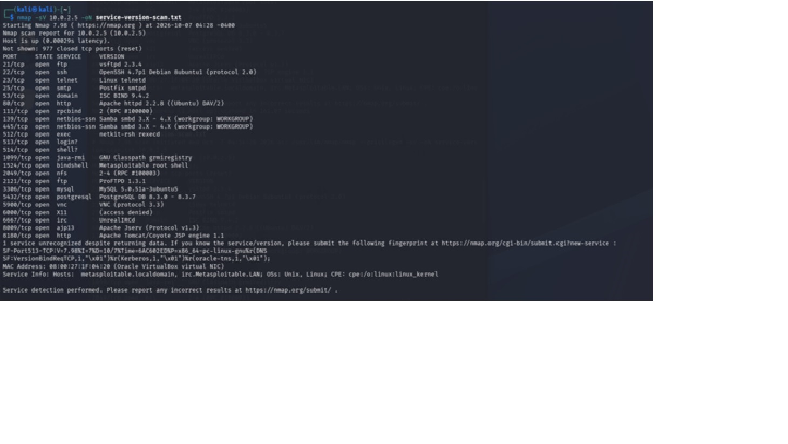
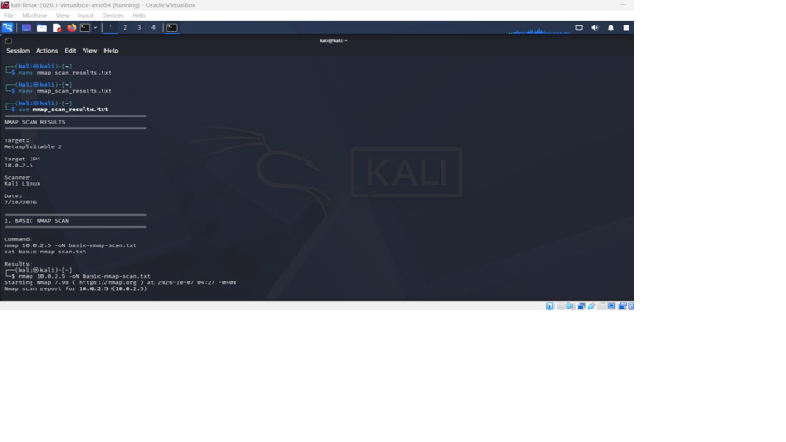

# Objective 

Perform a network scan to identify open ports and services running on a local machine or virtual machine using Nmap, and document your findings with security analysis.

# Tech Stack / Tools

Nmap, Linux terminal (or Windows PowerShell), a local VM (e.g., VirtualBox with Kali Linux or Ubuntu)


# Task 1: Basic Network Scanning with Nmap

## What is Nmap?

Nmap is also called Network Mapper. It is an open-source network scanning and security auditing tool. It is used to discover hosts and services on a network, identify open ports, detect running services and in some cases, determine the operating system of a target system.

In this lab, Nmap was used from Kali Linux to scan the Metasploitable 2 virtual machine in an isolated laboratory environment.

## Why Network Scanning Matters

Network scanning is an important part of cybersecurity because it helps security professionals understand what systems and services are accessible on a network.

Scanning can help to:

- Identify active hosts and open ports.
- Discover services running on systems that are on the network.
- Identify potential entry points that may require further security assessment.
- Detect services that are exposed.
- Provide information that can be used to improve network security and reduce the attack surface.

In this lab, Nmap scanning was used to identify the open ports and services on the intentionally vulnerable Metasploitable 2 system.

## Ethical Use Guidelines

Network scanning should only be performed on systems and networks where you have explicit authorization to conduct security testing.

Unauthorized scanning of systems or networks may violate organizational policies, terms of service, or applicable laws.

For this project, all scanning activities were performed in my own controlled and isolated cybersecurity laboratory using Metasploitable 2, an intentionally vulnerable virtual machine designed for security education and testing.

The techniques demonstrated in this project should only be applied to systems for which appropriate permission has been obtained.

## Test Connection

Testing connection between the target and the attacker machines


## Nmap Installation
Nmap was already pre-installed in the Kali Linux virtual machine used for this lab.
The installation was verified using:
nmap –version

The command confirmed that Nmap was installed and available for use.

The location of the Nmap executable was also verified using:
which nmap


## Basic Nmap Scan
A basic Nmap scan was performed against the Metasploitable 2 target and saved to basic-nmap-scan.txt

The command used was: nmap 10.0.2.5

## Results


## Observation

- The target host was reachable, which means that it was up.
- Nmap identified 23 open TCP ports among the 1,000 most common ports scanned.
- Multiple network services were exposed, including FTP, SSH, Telnet, HTTP, DNS, SMB, NFS, MySQL, PostgreSQL, VNC, and IRC.
- Several remote-access and file/database services were accessible over the network.
- Port 8180 was identified as open, but the service was unknown.
- The MAC address was identified as `08:00:27:1F:04:20` (Oracle VirtualBox virtual NIC).

## Service Version Scan

A service version scan was performed against the Metasploitable 2 target to identify the services and software versions running on the open ports and saved to service-version-scan.txt.

The command used was:
nmap -sV 10.0.2.5 -oN service-version-scan.txt

## Results

## Observations
-	The target machine is from the family of Unix/Linux.
-	Some of the versions are old
-	There is root shell running which gives highly privileged access to the system.

## Open Ports and Services

| Port | State | Service | Version |
|------|-------|---------|---------|
| 21 | Open | FTP | vsftpd 2.3.4 |
| 22 | Open | SSH | OpenSSH 4.7p1 |
| 23 | Open | Telnet | Linux telnetd |
| 25 | Open | SMTP | Postfix smtpd |
| 53 | Open | DNS | ISC BIND 9.4.2 |
| 80 | Open | HTTP | Apache 2.2.8 |
| 111 | Open | RPCbind | RPC 2 |
| 139 | Open | NetBIOS/SMB | Samba 3.x–4.x |
| 445 | Open | SMB | Samba 3.x–4.x |
| 512 | Open | rexec | netkit-rsh rexecd |
| 513 | Open | login | Unidentified |
| 514 | Open | shell | Unidentified |
| 1099 | Open | Java RMI | GNU Classpath grmiregistry |
| 1524 | Open | Bindshell | Metasploitable root shell |
| 2049 | Open | NFS | NFS 2–4 |
| 2121 | Open | FTP | ProFTPD 1.3.1 |
| 3306 | Open | MySQL | 5.0.51a |
| 5432 | Open | PostgreSQL | 8.3.x |
| 5900 | Open | VNC | Protocol 3.3 |
| 6000 | Open | X11 | Access denied |
| 6667 | Open | IRC | UnrealIRCd |
| 8009 | Open | AJP13 | Apache JServ Protocol 1.3 |
| 8180 | Open | HTTP | Apache Tomcat/Coyote |

## OS Detection Scan

An OS detection scan was performed against the Metasploitable 2 target to identify the operating system running on the host.

The command used was sudo nmap -O 10.0.2.5

## Results


## Observation
- The host is reachable.
- The machine is running on OS details: Linux 2.6.9 - 2.6.33  which is an older version.
- This proposes that the system is really vulnerable.

## Open ports found and the service running on each
| Port | State | Service |
|------|-------|---------|
| 21 | open | FTP |
| 22 | open | SSH |
| 23 | open | Telnet |
| 25 | open | SMTP |
| 53 | open | DNS |
| 80 | open | HTTP |
| 111 | open | RPCbind |
| 139 | open | NetBIOS/SMB |
| 445 | open | SMB |
| 512 | open | rexec |
| 513 | open | login |
| 514 | open | shell |
| 1099 | open | Java RMI |
| 1524 | open | Bindshell |
| 2049 | open | NFS |
| 2121 | open | FTP |
| 3306 | open | MySQL |
| 5432 | open | PostgreSQL |
| 5900 | open | VNC |
| 6000 | open | X11 |
| 6667 | open | IRC |
| 8009 | open | AJP13 |
| 8180 | open | HTTP |

## Open ports, a brief explanation of what the service does and whether it poses a security risk
| Port | State | Service | Version | What the Service Does / Security Risk |
|------|-------|---------|---------|---------------------------------------|
| 21 | Open | FTP | vsftpd 2.3.4 | **FTP** transfers files between systems. This old version may contain known vulnerabilities and FTP can transmit credentials without encryption. |
| 22 | Open | SSH | OpenSSH 4.7p1 | **SSH** provides secure remote login and administration. This is a very old version and should be assessed for known vulnerabilities and weak configurations. |
| 23 | Open | Telnet | Linux telnetd | **Telnet** provides remote command-line access. It is a high security risk because credentials and data are transmitted without encryption. |
| 25 | Open | SMTP | Postfix smtpd | **SMTP** handles the sending and receiving of email. An exposed mail service can be abused if poorly configured and should be checked for open-relay and other configuration issues. |
| 53 | Open | DNS | ISC BIND 9.4.2 | **DNS** translates domain names into IP addresses. This very old version may contain known vulnerabilities and should be assessed for insecure configuration. |
| 80 | Open | HTTP | Apache 2.2.8 | **HTTP** provides web services and hosts websites/applications. This very old Apache version increases the attack surface and should be assessed for known vulnerabilities. |
| 111 | Open | RPCbind | RPC 2 | **RPCbind** helps clients identify RPC services running on a system. Exposing RPC information can help an attacker identify additional services and potential attack paths. |
| 139 | Open | NetBIOS/SMB | Samba 3.x–4.x | **NetBIOS/SMB** supports network file and printer sharing. An exposed and outdated SMB service may allow unauthorized access or information disclosure if poorly secured. |
| 445 | Open | SMB | Samba 3.x–4.x | **SMB** provides network file and resource sharing. Exposure increases the attack surface and should be assessed for weak authentication, permissions and known vulnerabilities. |
| 512 | Open | rexec | netkit-rsh rexecd | **rexec** allows remote command execution. It is a legacy service that presents a significant security risk because it lacks the security protections of modern remote-access protocols. |
| 513 | Open | login | Unidentified | **Login/rlogin** provides remote login functionality. It is a legacy service and can expose credentials or remote access if not properly secured. |
| 514 | Open | shell | Unidentified | **Remote shell (rsh)** allows commands to be executed remotely. It is a legacy and insecure protocol that presents a significant security risk. |
| 1099 | Open | Java RMI | GNU Classpath grmiregistry | **Java RMI** enables Java applications to communicate with remote objects. An exposed RMI registry can create security risks if authentication and access controls are weak. |
| 1524 | Open | Bindshell | Metasploitable root shell | A **bind shell** provides remote command-line access to the system. In this lab, it provides highly privileged access and therefore represents a critical security risk. |
| 2049 | Open | NFS | NFS 2–4 | **NFS** allows filesystems to be shared over a network. If improperly configured, attackers may access, modify or mount sensitive files. |
| 2121 | Open | FTP | ProFTPD 1.3.1 | **FTP** provides file-transfer functionality. This outdated ProFTPD version should be assessed for known vulnerabilities and insecure configurations. |
| 3306 | Open | MySQL | 5.0.51a | **MySQL** provides database services for storing and managing application data. This very old version may contain known vulnerabilities and should not normally be directly exposed to untrusted networks. |
| 5432 | Open | PostgreSQL | 8.3.x | **PostgreSQL** provides database services. This very old version presents increased security risk and should be assessed for vulnerabilities and access-control weaknesses. |
| 5900 | Open | VNC | Protocol 3.3 | **VNC** provides remote graphical access to a computer. An exposed VNC service can allow unauthorized remote access if authentication or network restrictions are weak. |
| 6000 | Open | X11 | Access denied | **X11** provides graphical display services for Linux/Unix systems. An exposed X11 service can create security risks because of potential unauthorized access to graphical sessions. |
| 6667 | Open | IRC | UnrealIRCd | **IRC** provides real-time Internet chat communication. An exposed and outdated IRC service should be assessed for software vulnerabilities and unnecessary access. |
| 8009 | Open | AJP13 | Apache JServ Protocol 1.3 | **AJP13** allows communication between a web server and an application server such as Tomcat. An exposed AJP service can present security risks if improperly configured. |
| 8180 | Open | HTTP | Apache Tomcat/Coyote | **HTTP/Tomcat** provides web application services. An exposed application server increases the attack surface and should be assessed for outdated software, weak configuration and vulnerable applications. |

The findings were documented in nmap_scan_results.txt file

On  Kali terminal

I created the file with: nano nmap_scan_results.txt

This opens a text editor.


# NMAP Scan Results

## Scan Information

- **Target:** Metasploitable 2
- **Target IP:** `10.0.2.5`
- **Scanner:** Kali Linux
- **Date:** 07/10/2026

## 1. Basic Nmap Scan

### Command

```bash
nmap 10.0.2.5 -oN basic-nmap-scan.txt
cat basic-nmap-scan.txt
```

### Results

```text
Starting Nmap 7.98 (https://nmap.org) at 2026-10-07 04:27 -0400

Nmap scan report for 10.0.2.5
Host is up (0.00026s latency).

PORT     STATE SERVICE
21/tcp   open  ftp
22/tcp   open  ssh
23/tcp   open  telnet
25/tcp   open  smtp
53/tcp   open  domain
80/tcp   open  http
111/tcp  open  rpcbind
139/tcp  open  netbios-ssn
445/tcp  open  microsoft-ds
512/tcp  open  exec
513/tcp  open  login
514/tcp  open  shell
1099/tcp open  rmiregistry
1524/tcp open  ingreslock
2049/tcp open  nfs
2121/tcp open  ccproxy-ftp
3306/tcp open  mysql
5432/tcp open  postgresql
5900/tcp open  vnc
6000/tcp open  X11
6667/tcp open  irc
8009/tcp open  ajp13
8180/tcp open  unknown

MAC Address: 08:00:27:1F:04:20 (Oracle VirtualBox virtual NIC)

Nmap done: 1 IP address (1 host up) scanned in 0.32 seconds
```

### Observation

The basic Nmap scan identified **23 open TCP ports** on the target machine. Services such as **FTP, SSH, Telnet, HTTP, SMB, MySQL, PostgreSQL, NFS, and VNC** were discovered, indicating multiple potential attack surfaces for further investigation.

---

## 2. Service Version Scan

### Command

```bash
nmap -sV 10.0.2.5 -oN service-version-scan.txt
cat service-version-scan.txt
```

### Results

```text
Starting Nmap 7.98 (https://nmap.org) at 2026-10-07 04:28 -0400

Nmap scan report for 10.0.2.5
Host is up (0.00029s latency).

PORT     STATE SERVICE     VERSION
21/tcp   open  ftp         vsftpd 2.3.4
22/tcp   open  ssh         OpenSSH 4.7p1 Debian 8ubuntu1
23/tcp   open  telnet      Linux telnetd
25/tcp   open  smtp        Postfix smtpd
53/tcp   open  domain      ISC BIND 9.4.2
80/tcp   open  http        Apache httpd 2.2.8 ((Ubuntu) DAV/2)
111/tcp  open  rpcbind     2 (RPC #100000)
139/tcp  open  netbios-ssn Samba smbd 3.X - 4.X
445/tcp  open  netbios-ssn Samba smbd 3.X - 4.X
512/tcp  open  exec        netkit-rsh rexecd
513/tcp  open  login?
514/tcp  open  shell?
1099/tcp open  java-rmi    GNU Classpath grmiregistry
1524/tcp open  bindshell   Metasploitable root shell
2049/tcp open  nfs         2-4 (RPC #100003)
2121/tcp open  ftp         ProFTPD 1.3.1
3306/tcp open  mysql       MySQL 5.0.51a-3ubuntu5
5432/tcp open  postgresql  PostgreSQL DB 8.3.0 - 8.3.7
5900/tcp open  vnc         VNC (protocol 3.3)
6000/tcp open  X11         (access denied)
6667/tcp open  irc         UnrealIRCd
8009/tcp open  ajp13       Apache Jserv (Protocol v1.3)
8180/tcp open  http        Apache Tomcat/Coyote JSP engine 1.1

Service Info:
Hosts: metasploitable.localdomain, irc.Metasploitable.LAN
OSs: Unix, Linux
```

### Observation

The service version scan revealed detailed information about the services running on the target. Several outdated and intentionally vulnerable services were identified, including:

- **vsftpd 2.3.4** (FTP)
- **Samba 3.x**
- **UnrealIRCd**
- **ProFTPD 1.3.1**
- **Apache Tomcat**
- **MySQL 5.0.51**
- **Metasploitable Root Shell (Port 1524)**

The discovered versions provide valuable information for vulnerability assessment and future penetration testing activities.

## 3. OS Detection Scan

### Command

```bash
sudo nmap -O 10.0.2.5 -oN OS-detection-scan.txt
cat OS-detection-scan.txt
```

### Results

```text
Starting Nmap 7.98 (https://nmap.org) at 2026-10-07 04:32 -0400

Nmap scan report for 10.0.2.5
Host is up (0.00040s latency).

PORT     STATE SERVICE
21/tcp   open  ftp
22/tcp   open  ssh
23/tcp   open  telnet
25/tcp   open  smtp
53/tcp   open  domain
80/tcp   open  http
111/tcp  open  rpcbind
139/tcp  open  netbios-ssn
445/tcp  open  microsoft-ds
512/tcp  open  exec
513/tcp  open  login
514/tcp  open  shell
1099/tcp open  rmiregistry
1524/tcp open  ingreslock
2049/tcp open  nfs
2121/tcp open  ccproxy-ftp
3306/tcp open  mysql
5432/tcp open  postgresql
5900/tcp open  vnc
6000/tcp open  X11
6667/tcp open  irc
8009/tcp open  ajp13
8180/tcp open  unknown

MAC Address: 08:00:27:1F:04:20 (Oracle VirtualBox virtual NIC)

Device type: general purpose
Running: Linux 2.6.X
OS CPE: cpe:/o:linux:linux_kernel:2.6
OS details: Linux 2.6.9 - 2.6.33
Network Distance: 1 hop
```

### Observation

The OS detection scan identified the target as a **Linux-based operating system** running a **Linux 2.6.x kernel**. Nmap estimated the operating system version to be between **Linux 2.6.9 and 2.6.33**.

Key observations:

- The target is a **general-purpose Linux host**.
- The detected kernel version is **very old and outdated**.
- The system is only **1 network hop away**, indicating it is located on the same local network.
- The scan confirmed the presence of numerous open services, increasing the attack surface.
- The MAC address vendor was identified as **Oracle VirtualBox**, indicating the target is running as a virtual machine.

---

# Open Ports, Services, Versions and Security Risks

| Port | State | Service | Version | Security Risk / Description |
|--------|--------|--------|--------|--------|
| 21 | Open | FTP | vsftpd 2.3.4 | FTP transfers files between systems. This outdated version may contain known vulnerabilities and transmits credentials without encryption. |
| 22 | Open | SSH | OpenSSH 4.7p1 | SSH provides secure remote administration. This version is outdated and should be checked for known vulnerabilities and weak configurations. |
| 23 | Open | Telnet | Linux telnetd | Telnet provides remote access but does not encrypt traffic, making it a significant security risk. |
| 25 | Open | SMTP | Postfix smtpd | SMTP handles email delivery. Misconfigurations may allow abuse such as spam relaying. |
| 53 | Open | DNS | ISC BIND 9.4.2 | DNS resolves domain names. This outdated version may contain known vulnerabilities. |
| 80 | Open | HTTP | Apache 2.2.8 | Hosts web services and applications. This Apache version is outdated and increases attack exposure. |
| 111 | Open | RPCbind | RPC 2 | RPCbind maps RPC services and may reveal information useful to attackers. |
| 139 | Open | NetBIOS/SMB | Samba 3.x-4.x | Provides file and printer sharing services. Outdated versions may expose sensitive resources. |
| 445 | Open | SMB | Samba 3.x-4.x | Network file-sharing service that should be assessed for vulnerabilities and weak permissions. |
| 512 | Open | rexec | netkit-rsh rexecd | Legacy remote command execution service that lacks modern security protections. |
| 513 | Open | login | Unidentified | Remote login service that may expose credentials if improperly secured. |
| 514 | Open | shell | Unidentified | Remote shell service that is considered insecure and outdated. |
| 1099 | Open | Java RMI | GNU Classpath grmiregistry | Enables remote Java object communication. Improper exposure can create security risks. |
| 1524 | Open | Bindshell | Metasploitable Root Shell | Provides direct remote shell access and represents a critical security risk. |
| 2049 | Open | NFS | NFS v2-v4 | Network file-sharing service that may expose sensitive files if misconfigured. |
| 2121 | Open | FTP | ProFTPD 1.3.1 | Outdated FTP server that should be assessed for vulnerabilities. |
| 3306 | Open | MySQL | MySQL 5.0.51a | Database service that should not typically be exposed externally. This version is outdated. |
| 5432 | Open | PostgreSQL | PostgreSQL 8.3.x | Database service running an old version with potential security weaknesses. |
| 5900 | Open | VNC | Protocol 3.3 | Provides remote graphical access and may allow unauthorized access if poorly secured. |
| 6000 | Open | X11 | Access Denied | Linux graphical display service that can introduce security concerns if exposed. |
| 6667 | Open | IRC | UnrealIRCd | Chat service running an outdated version that should be evaluated for vulnerabilities. |
| 8009 | Open | AJP13 | Apache JServ Protocol 1.3 | Connector between Apache and Tomcat. Misconfiguration can expose backend services. |
| 8180 | Open | HTTP | Apache Tomcat/Coyote | Web application server that increases the attack surface if outdated or improperly configured. |

---

# Summary

The Nmap scans revealed **23 open TCP ports** on the Metasploitable 2 target system. Multiple network services were identified, including:

- FTP
- SSH
- Telnet
- SMTP
- DNS
- HTTP
- SMB
- NFS
- MySQL
- PostgreSQL
- VNC
- Tomcat

The service version scan showed that many applications are **outdated and intentionally vulnerable**, making the system suitable for penetration testing practice. Notable findings include:

- **vsftpd 2.3.4**
- **Samba 3.x**
- **ProFTPD 1.3.1**
- **UnrealIRCd**
- **Apache Tomcat**
- **MySQL 5.0.51a**
- **Metasploitable Root Shell on Port 1524**

The OS detection scan identified the target as a **Linux 2.6.x system** running inside an **Oracle VirtualBox virtual machine**. The large number of exposed services significantly increases the attack surface and provides multiple opportunities for further enumeration and vulnerability assessment.

---

# Save the Report Using Nano

To save the file:

1. Press **Ctrl + O**
2. Press **Enter** to confirm the filename
3. Press **Ctrl + X** to exit Nano

### Verify the File Exists
use **cat nmap_scan_results.txt**
